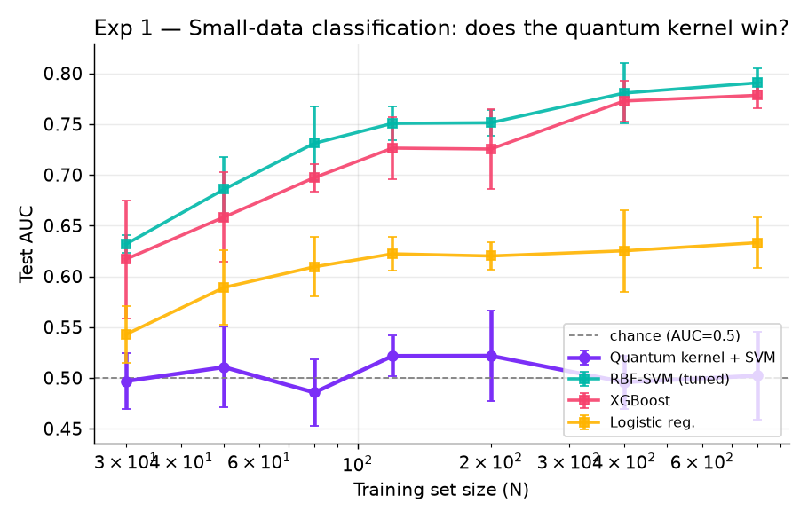
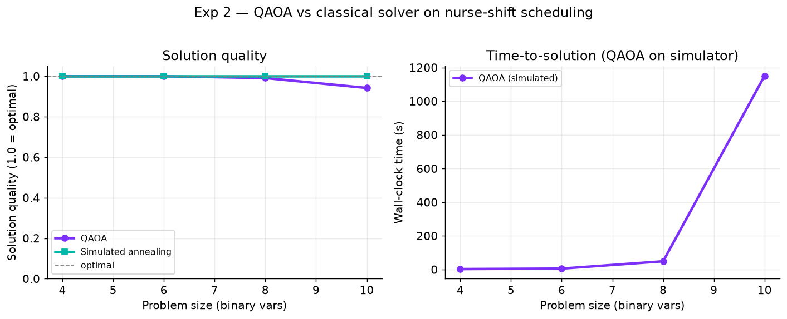
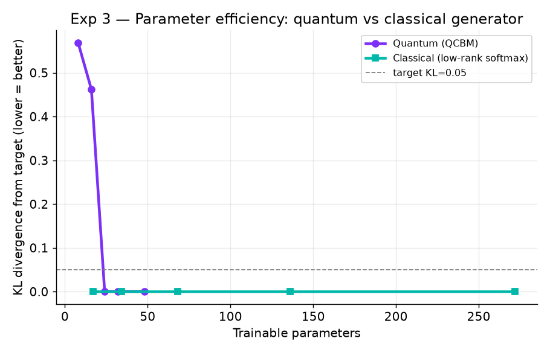

# I Tested Quantum Computing's Healthcare Hype. Here Is What the Numbers Said.

*Three tests. One laptop. No hype.*

---

## The pitch you keep hearing

Open any tech feed and there it is. Quantum computing will change healthcare. Faster drug discovery. Smarter patient risk models. Better hospital and clinic planning.

Great story. So I tested it.

I built three small tests. Each one aims at a claim people repeat about where quantum should already win. I gave the classical side a real, tuned fight. No weak opponents. Then an AI read the raw numbers and made the call. All of it runs free, on a laptop, on quantum simulators.

Here is what I found.

## One fact changes how you read all of this

No one has shown a real quantum win on a useful problem. Not in healthcare. Not anywhere. Quantum models are also hard to train, for reasons that run deep.

That does not make quantum a scam. It makes it early. And early is exactly when the hype runs ahead of the truth. So this is the moment a calm, tested look pays off.

## The three tests

I picked three spots people call quantum's home turf. If quantum helps healthcare soon, it shows up here first. So this is the best shot it gets.

### Test 1: quantum shines when data is scarce (think rare diseases)

Rare diseases come with tiny datasets. People say quantum "similarity" reads more from few examples. I put a quantum-kernel classifier against a tuned RBF-SVM, XGBoost, and logistic regression on a fake patient group. I grew the training set from 30 patients to 800.



**Verdict: Hype.** The quantum kernel sat on the coin-flip line at every size. Classical climbed to 0.79. This is a known trap called kernel concentration. The quantum trick made everything look the same. A quantum "similarity score" is not a better one.

### Test 2: quantum optimization rivals classical solvers (think scheduling)

Hospitals run on hard puzzles. Who works which shift. Where to place a clinic. I turned nurse scheduling into a math problem and solved it with QAOA, then with classical annealing and brute force.



**Verdict: Mixed, and telling.** QAOA found good schedules. But look at the right chart. The time to simulate it blew up as the puzzle grew. Twenty minutes for a ten-variable toy. Classical annealing found the perfect answer on every run, at once. QAOA can find good answers. It just had no edge here, in speed or quality.

### Test 3: quantum needs far fewer knobs to tune

This is the crown jewel, backed by real papers. A quantum generator learns a pattern with far fewer settings than a classical one. I rebuilt it with a lean classical generator to match: a Quantum Circuit Born Machine against it, learning a spread of patient risk buckets.



**Verdict: Hype.** Both learned the pattern. The classical model needed 17 parameters. The quantum one needed 24. The famous "quantum uses way fewer knobs" line did not hold once the classical side was allowed to be lean too.

## The scorecard

| Claim | Verdict |
|---|---|
| Quantum wins on small data | 🔴 **Hype**. Stayed at a coin flip. Classical hit 0.79. |
| QAOA rivals classical solvers | 🟡 **Mixed**. Good answers, but slow, and no edge. |
| Quantum generators need fewer knobs | 🔴 **Hype**. Classical was leaner, 17 to 24. |

## So is quantum pointless for healthcare?

No. And that is the part both the hype crowd and the cynics miss.

Three toy tests on a clean simulator cannot prove quantum will never help. They prove something more useful. Today, on the tasks quantum is supposed to own, a well-built classical laptop still wins. Knowing where the edge is *not* yet is how you spot the day it moves. And it will move.

If you run engineering at a hospital, an insurer, or a health system, the takeaway is simple. Stay curious. Stay patient. Ask for the benchmark. When a vendor claims a quantum win, ask to see the tuned classical opponent. Most days, that question ends the pitch.

## The AI twist

An AI wrote every verdict here. It read the raw numbers under one rule: stay skeptical, cite the data, do not cheer for quantum. That is the right way to use AI. A fast, steady analyst over your own numbers. It is the same move that earns its keep in healthcare ops, turning a wall of data into a plain-English brief a human can act on.

## Try it yourself

The whole thing is open source and runs with one command on your laptop. No quantum hardware. No cloud account. No patient data. The group is fake.

```bash
pip install -r requirements.txt
python run_all.py
```

👉 **[GitHub repo](https://github.com/amitchorasiya/quantum-healthcare-reality-check)**. Code, charts, and the AI verdicts are all in there.

*An independent project. Not tied to or backed by any company named here. MIT-licensed.*
